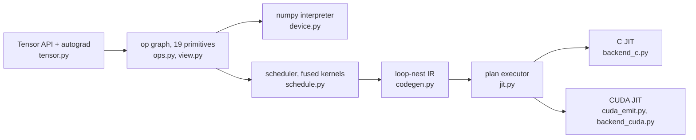

# limn

*limn (verb): to outline in clear sharp detail; to delineate.*


A deep learning framework built to be read. The whole stack is here: lazy tensors over a
closed set of 19 primitive ops, reverse-mode autograd, a scheduler that fuses the graph into
kernels, an IR you can print, and C and CUDA backends that JIT-compile it, in about 3,200
lines of Python with numpy as the only runtime dependency. In spirit it sits between
micrograd and tinygrad: small enough to read in one sitting, real enough that a matmul comes
out the other end as one fused loop nest with the stride-1 dim innermost.

```python
from limn import Tensor

x = Tensor.randn((4, 3), requires_grad=True)
loss = ((x @ Tensor.randn((3, 2))).relu() ** 2).sum()
loss.backward()          # gradients are lazy graphs too
print(x.grad.numpy())    # nothing computes until here
```

## Getting started

```
git clone https://github.com/jiffies64/limn.git
cd limn
uv sync
uv run pytest                            # the whole suite, about ten seconds
uv run python examples/train_mlp.py      # AdamW on a toy regression; loss must drop 20x
uv run python examples/train_stories.py  # byte-level GPT on TinyStories; --full for the long run
```

`uv sync` installs numpy plus the dev group (pytest, ruff, CPU-only torch). The `c` device
also needs a C compiler on `PATH` as `cc`. The `cuda` device needs an NVIDIA driver and
NVRTC: either a CUDA toolkit, or no root access at all with `uv sync --extra cuda`, which
pulls NVRTC as a wheel.

Contributing? `git config core.hooksPath .githooks` turns on the repo hooks: commit messages
follow `type: subject` (feat, fix, docs, refactor, test, speedup, chore) and pushes run the
linter and the test suite.

## Architecture

Tensor methods never compute. They build a DAG over the primitive ops, and the graph runs
only when someone asks for bytes (`.numpy()`, `.item()`, `.realize()`). Autograd lives at the
same layer: `backward()` walks the recorded graph in reverse, and the gradients it builds are
lazy graphs like everything else.



Three rules hold it together:

- **The op set is closed.** `sub`, `div`, `matmul`, `softmax`, `relu`, comparisons: all
  composed in `tensor.py` from the 19 primitives, so a backend implements those and gets
  everything else for free.
- **The numpy device is the permanent reference.** It interprets the graph one numpy call per
  node, no fusion, no cleverness. Every compiled backend is diffed against it. Being a reference
  rather than a backend costs it the shapes fusion exists for: a matmul is a broadcast multiply
  and a reduce, so it builds the whole (m, n, k) intermediate instead of walking it, and a large
  one runs out of memory rather than slowly. Diff compiled kernels against it at sizes whose
  product fits, not whose operands do.
- **Layout is arithmetic, not data.** A `View` is (shape, strides, offset, mask). `reshape`,
  `permute`, `expand`, `pad`, and `shrink` compose into a single `View`, cost nothing when
  built, and lower to index arithmetic inside the kernels. Indexing (`x[0, 1:5]`, `...`, `None`)
  is a `shrink` and a `reshape` in Python syntax, and iterating or unpacking (`q, k, v = qkv`)
  walks dim 0 the same way; a step other than 1 has no `View` behind it and says so.

### The op set

| group | ops |
|---|---|
| sources | `BUFFER`, `CONST` |
| movement | `VIEW` |
| elementwise unary | `NEG`, `EXP`, `LOG`, `SQRT`, `RECIP`, `CAST` |
| elementwise binary | `ADD`, `MUL`, `CMPLT` |
| elementwise ternary | `WHERE` |
| reduce | `SUM`, `MAX` |
| indexed | `GATHER`, `SCATTER` |
| barriers | `CONTIGUOUS`, `ASSIGN` |

Six dtypes: `float64`, `float32`, `float16`, `int32`, `int16`, and `int8`. `float16` is a
storage width, not a working precision: it halves the bytes a kernel moves, and every device
widens it to compute, so a reduce keeps its running total in `float32` and rounds back once at
the end. Mixing it with `float32` promotes, and casting between the two carries gradients,
which is what makes a `float32` master weight met by `float16` activations train. `float64` is
the opposite trade: every device computes it natively at its own width, and gradients and
optimizer state keep that width. The narrow ints are exact storage: arithmetic wraps modulo
2**width, the same on every device, a python scalar takes the tensor's dtype rather than
widening it, and an int meeting a float joins the floats at `float32` or wider. The `c` device
has no `float16` and says so; on `cuda` a `float16` scatter is the one float-family gap, since
its atomic add needs an architecture the emitter cannot see, and a narrow-int scatter declines
because `atomicAdd` has no 8- or 16-bit overload.

## Reading the schedule

`limn.schedule` cuts the DAG into kernels: elementwise work fuses into whatever consumes it,
and a cut falls wherever a value has to exist in memory (a reduce, a copy, an assign,
anything a view addresses). `limn.codegen` lowers each kernel into a loop nest, turning views
into index arithmetic. The result prints, and it is exactly what the compiled backends run:

```python
from limn import Tensor
from limn.codegen import ir

print(ir(Tensor.randn((4, 5)) @ Tensor.randn((5, 3))))
```

```
k0  SUM  loop[4, 3, 5]
    in0 = buf0  float32[4, 5]
    in1 = buf1  float32[5, 3]
    out = buf2  float32[4, 3, 1]
  LOOP    i0 < 4
    LOOP    i1 < 3
      CONST   v0 = 0.0 : float32
      STORE   out[i0*3 + i1] = v0
    ENDLOOP i1
  ENDLOOP i0
  LOOP    i0 < 4
    LOOP    r2 < 5
      LOOP    i1 < 3
        LOAD    v1 = in0[i0*5 + r2] : float32
        LOAD    v2 = in1[i1 + r2*3] : float32
        ARITH   v3 = MUL v1, v2 : float32
        ACCUM   out[i0*3 + i1] = ADD out[i0*3 + i1], v3
      ENDLOOP i1
    ENDLOOP r2
  ENDLOOP i0

sink 0 = buf2  float32[4, 3]
```

Two things the dump shows:

- **A whole matmul is one kernel.** Broadcast, multiply, and reduce fuse into a single nest,
  and dropping the reduce's kept dim afterwards moves no data: `sink 0`, the (4, 3) answer,
  aliases the (4, 3, 1) buffer instead of copying it.
- **Loop order is chosen, not inherited.** The innermost loop decides how the nest walks
  memory, so `loop_order` moves the dim that is stride-1 in the most buffers there: `i1`, not
  the reduce axis `r2`. A reduce axis with loops inside it cannot keep its running totals in
  a register, so this nest fills the output with the reduce identity first and folds into it
  with `ACCUM`.

A pad is the other thing that decides what the innermost loop costs, and it does not show
above because a matmul has nothing masked. A padded read lowers to a range check on a loop
variable; on the *innermost* variable that guards a load per element, which `cc` turns into a
masked load and then declines to vectorise the loop around. So the C backend cuts that loop at
the mask's edges before emitting it, leaving every piece wholly inside the pad or wholly
outside it, where the check folds away to nothing or to a literal zero. The iterations and
their order are unchanged, so the answer is bit-identical. It is worth about 2x on a padded
conv, landing it beside its unpadded twin, and nothing at all on a nest with no mask
innermost, which emits the source it always did.

## Backends

`set_device` picks the executor. The host devices share bytes, so tensors move freely
between them; the cuda device's memory rules are a paragraph down.

```python
import numpy as np
from limn import Tensor, set_device

set_device("c")            # "numpy" is the default, and stays the reference
x = Tensor(np.random.rand(64, 32).astype(np.float32))
print((x @ x.transpose()).sum().item())
```

| device | pipeline | requires |
|---|---|---|
| `numpy` | interprets the op graph, one numpy call per node | nothing |
| `c` | schedule → loop-nest IR → C source → `cc -O3 -march=native` → ctypes | a C compiler |
| `cuda` | schedule → loop-nest IR → CUDA C → NVRTC → PTX → driver API | an NVIDIA driver, and NVRTC from a toolkit or `uv sync --extra cuda` |

The cuda device picks one of three kernel shapes per nest. One thread per output cell is the
default. A long reduce over few cells splits into strided partial totals and a fold, the one
shape that regroups the arithmetic. A nest that reads as a matmul gets a block per output tile,
both operands staged through shared memory and a patch of cells held in registers per thread,
which leaves the numbers alone: the reduce axis is still walked in order, so only where the
operands are read from changes.

Both compiled devices cache twice: programs by source hash, execution plans by graph
structure. A training loop at fixed shapes schedules, emits, and compiles on the first step;
every step after goes straight to the compiled kernels. Selecting a device whose toolchain is
missing fails at `set_device` with the reason, not later inside a subprocess.

The cuda device binds libcuda and NVRTC through ctypes at runtime, so nothing is pinned to a
CUDA version: kernels compile to PTX for the newest architecture the loaded NVRTC supports
that does not exceed the GPU's, and the driver JIT covers the gap when the GPU is newer than
the toolkit. One thread runs one point of the non-reduce dims with reduce loops sequential
inside it, so results fold in the same order as the C backend and only scatters need
atomics. Its buffers live in GPU memory: host tensors handed to it are uploaded per batch
(and assigns to them written back), but tensors created under cuda are readable only there.

### Adding one

The IR is the contract: twelve opcodes (loops, loads, arithmetic, accumulators, stores) with
all index arithmetic made explicit, and `jit.py` already owns planning, caching and the
assign transaction. A backend is one rendering of that instruction stream plus five hooks
for moving bytes. `backend_c.py` is both halves for C; on the CUDA side the rendering lives
in `cuda_emit.py` and the hooks in `backend_cuda.py`.

## nn and optim

`limn.nn` holds `Linear`, `LayerNorm`, `Embedding`, and a `parameters()` walker that collects
every trainable tensor reachable from a module's attributes. `limn.optim` holds `SGD` (with
momentum) and `AdamW`. An optimizer step is a batch of `ASSIGN` graphs committed in one
`realize()`, so every update expression reads pre-step values and update order cannot matter.
Semantics match `torch.nn` and `torch.optim` down to weight layouts, LayerNorm's biased
variance, and AdamW's decoupled weight decay; the tests hold them to it step for step.

## Correctness

Every layer answers to an oracle above it:

| layer | oracle | how |
|---|---|---|
| ops + autograd | PyTorch (CPU, test-only) | a seeded fuzzer builds 300 random DAGs (movement, broadcasting, reduces, matmul), runs them forward and backward in both frameworks, and requires agreement to 1e-4; failures print a reproducer |
| scheduler + codegen | the numpy device | tests interpret the lowered IR instruction by instruction and diff the numbers, so the printed nest means what it says (strides, masks, reduce identities) |
| `c` backend | the numpy device | a shared graph corpus runs on both devices and is diffed at 1e-5 |
| `cuda` backend | the numpy device | the same corpus, plus grid-stride coverage past one launch's thread count, atomic scatter collisions on a single row, tiled matmuls across every tile width and tail, and a training loop on the device |
| cuda emission | its own invariants | no GPU needed: the tiling decision is checked for covering every output cell and for staging whole slabs, since a tile the block cannot fill in whole passes would fold shared memory nobody wrote |
| `float16` | the numpy device | the corpus and the matmuls again at half width, diffed at float16's own rounding, plus the dtype rules and that a cast between float dtypes still carries gradients |
| `int8`, `int16` | the numpy device | an integer corpus (wraparound, compares, reduces, matmul, gather) on the `c` and `cuda` devices, diffed for exact equality since modular arithmetic leaves nothing to rounding |
| `float64` | the numpy device | the corpus and the tiled matmuls again in double, diffed at 1e-12, plus that gradients and optimizer state hold the width and that a `cuda` scatter adds atomically in double |

## Layout

```
limn/
  ops.py         the 19 primitives and the Node DAG
  view.py        layout algebra: shape, strides, offset, mask
  tensor.py      user API: broadcasting, composed ops, autograd
  device.py      the device protocol and the numpy reference interpreter
  schedule.py    cuts the graph into fused kernels
  codegen.py     lowers kernels to the printable loop-nest IR
  jit.py         the shared executor: plan caching and the assign transaction
  backend_c.py   renders the IR as C, compiles it, calls it through ctypes
  cuda_emit.py   renders the IR as CUDA C: one thread per cell, split reduces, tiled matmuls
  backend_cuda.py  binds the driver and NVRTC, compiles, owns device memory and launching
  nn.py          Linear, LayerNorm, Embedding
  optim.py       SGD, AdamW
tests/           one file per layer, a 300-case autograd fuzzer, an IR interpreter
examples/        train_mlp.py, a toy regression; train_stories.py, a byte-level GPT on TinyStories
```
