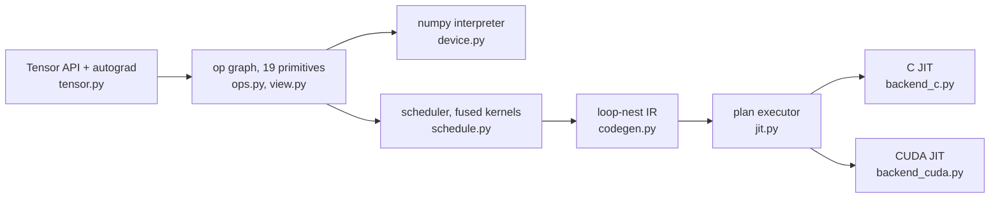

# limn

*limn (verb): to outline in clear sharp detail; to delineate.*


A deep learning framework built to be read. The whole stack is here: lazy tensors over a
closed set of 19 primitive ops, reverse-mode autograd, a scheduler that fuses the graph into
kernels, an IR you can print, and C and CUDA backends that JIT-compile it, in about 2,500
lines of Python with numpy as the only runtime dependency. In spirit it sits between
micrograd and tinygrad: small enough to read in one sitting, real enough that a matmul comes
out the other end as one fused loop nest with the stride-1 dim innermost.

```python
from limn import Tensor

x = Tensor.randn((4, 3), requires_grad=True)
loss = ((x @ Tensor.randn((3, 2))).relu() ** 2).sum()
loss.backward()          # gradients are lazy graphs too
print(x.grad.numpy())    # nothing computes until here
```

## Getting started

```
git clone https://github.com/jiffies64/limn.git
cd limn
uv sync
uv run pytest                          # the whole suite, about ten seconds
uv run python examples/train_mlp.py    # AdamW on a toy regression; loss must drop 20x
```

`uv sync` installs numpy plus the dev group (pytest, ruff, CPU-only torch). The `c` device
also needs a C compiler on `PATH` as `cc`. The `cuda` device needs an NVIDIA driver and
NVRTC: either a CUDA toolkit, or no root access at all with `uv sync --extra cuda`, which
pulls NVRTC as a wheel.

Contributing? `git config core.hooksPath .githooks` turns on the repo hooks: commit messages
follow `type: subject` (feat, fix, docs, refactor, test, speedup, chore) and pushes run the
linter and the test suite.

## Architecture

Tensor methods never compute. They build a DAG over the primitive ops, and the graph runs
only when someone asks for bytes (`.numpy()`, `.item()`, `.realize()`). Autograd lives at the
same layer: `backward()` walks the recorded graph in reverse, and the gradients it builds are
lazy graphs like everything else.



Three rules hold it together:

- **The op set is closed.** `sub`, `div`, `matmul`, `softmax`, `relu`, comparisons: all
  composed in `tensor.py` from the 19 primitives, so a backend implements those and gets
  everything else for free.
- **The numpy device is the permanent reference.** It interprets the graph one numpy call per
  node, no fusion, no cleverness. Every compiled backend is diffed against it.
- **Layout is arithmetic, not data.** A `View` is (shape, strides, offset, mask). `reshape`,
  `permute`, `expand`, `pad`, and `shrink` compose into a single `View`, cost nothing when
  built, and lower to index arithmetic inside the kernels.

### The op set

| group | ops |
|---|---|
| sources | `BUFFER`, `CONST` |
| movement | `VIEW` |
| elementwise unary | `NEG`, `EXP`, `LOG`, `SQRT`, `RECIP`, `CAST` |
| elementwise binary | `ADD`, `MUL`, `CMPLT` |
| elementwise ternary | `WHERE` |
| reduce | `SUM`, `MAX` |
| indexed | `GATHER`, `SCATTER` |
| barriers | `CONTIGUOUS`, `ASSIGN` |

Two dtypes: `float32` and `int32`.

## Reading the schedule

`limn.schedule` cuts the DAG into kernels: elementwise work fuses into whatever consumes it,
and a cut falls wherever a value has to exist in memory (a reduce, a copy, an assign,
anything a view addresses). `limn.codegen` lowers each kernel into a loop nest, turning views
into index arithmetic. The result prints, and it is exactly what the compiled backends run:

```python
from limn import Tensor
from limn.codegen import ir

print(ir(Tensor.randn((4, 5)) @ Tensor.randn((5, 3))))
```

```
k0  SUM  loop[4, 3, 5]
    in0 = buf0  float32[4, 5]
    in1 = buf1  float32[5, 3]
    out = buf2  float32[4, 3, 1]
  LOOP    i0 < 4
    LOOP    i1 < 3
      CONST   v0 = 0.0 : float32
      STORE   out[i0*3 + i1] = v0
    ENDLOOP i1
  ENDLOOP i0
  LOOP    i0 < 4
    LOOP    r2 < 5
      LOOP    i1 < 3
        LOAD    v1 = in0[i0*5 + r2] : float32
        LOAD    v2 = in1[i1 + r2*3] : float32
        ARITH   v3 = MUL v1, v2 : float32
        ACCUM   out[i0*3 + i1] = ADD out[i0*3 + i1], v3
      ENDLOOP i1
    ENDLOOP r2
  ENDLOOP i0

sink 0 = buf2  float32[4, 3]
```

Two things the dump shows:

- **A whole matmul is one kernel.** Broadcast, multiply, and reduce fuse into a single nest,
  and dropping the reduce's kept dim afterwards moves no data: `sink 0`, the (4, 3) answer,
  aliases the (4, 3, 1) buffer instead of copying it.
- **Loop order is chosen, not inherited.** The innermost loop decides how the nest walks
  memory, so `loop_order` moves the dim that is stride-1 in the most buffers there: `i1`, not
  the reduce axis `r2`. A reduce axis with loops inside it cannot keep its running totals in
  a register, so this nest fills the output with the reduce identity first and folds into it
  with `ACCUM`.

## Backends

`set_device` picks the executor. The host devices share bytes, so tensors move freely
between them; the cuda device's memory rules are a paragraph down.

```python
import numpy as np
from limn import Tensor, set_device

set_device("c")            # "numpy" is the default, and stays the reference
x = Tensor(np.random.rand(64, 32).astype(np.float32))
print((x @ x.transpose()).sum().item())
```

| device | pipeline | requires |
|---|---|---|
| `numpy` | interprets the op graph, one numpy call per node | nothing |
| `c` | schedule → loop-nest IR → C source → `cc -O3 -march=native -fopenmp` → ctypes | a C compiler |
| `cuda` | schedule → loop-nest IR → CUDA C → NVRTC → PTX → driver API | an NVIDIA driver, and NVRTC from a toolkit or `uv sync --extra cuda` |

Both compiled devices cache twice: programs by source hash, execution plans by graph
structure. A training loop at fixed shapes schedules, emits, and compiles on the first step;
every step after goes straight to the compiled kernels. Selecting a device whose toolchain is
missing fails at `set_device` with the reason, not later inside a subprocess.

The c device runs on every core. `-march=native` gets a nest the host's vector width, which is
one core's worth of speed; the cores come from handing a nest's leading non-reduce loops to an
OpenMP team, fusing as many of them as it takes to have work for every thread. Those are the
dims the output is indexed by, so the threads split the output cells between them and each cell
is still computed start to finish by one thread, folding in the order the serial nest folds:
threading a kernel changes which core produced a number, not the number. The tests hold it to
that bit for bit. A nest whose outermost loop is a reduce axis (a full reduce, or one whose only
surviving dim is the stride-1 one) and a scatter's colliding adds stay serial, since neither can
be split without regrouping the arithmetic; on an MLP step and on the convnet in
`examples/mnist.py` they are under 1% of the time in kernels. The team is one thread per
physical core unless `OMP_NUM_THREADS` says otherwise, and a `cc` with no OpenMP runtime gets
the same source without the pragmas.

The cuda device binds libcuda and NVRTC through ctypes at runtime, so nothing is pinned to a
CUDA version: kernels compile to PTX for the newest architecture the loaded NVRTC supports
that does not exceed the GPU's, and the driver JIT covers the gap when the GPU is newer than
the toolkit. One thread runs one point of the non-reduce dims with reduce loops sequential
inside it, so results fold in the same order as the C backend and only scatters need
atomics. Its buffers live in GPU memory: host tensors handed to it are uploaded per batch
(and assigns to them written back), but tensors created under cuda are readable only there.

### Adding one

The IR is the contract: twelve opcodes (loops, loads, arithmetic, accumulators, stores) with
all index arithmetic made explicit, and `jit.py` already owns planning, caching and the
assign transaction. A backend is one rendering of that instruction stream plus five hooks
for moving bytes, which is exactly what `backend_c.py` is for C and `backend_cuda.py` is for
CUDA.

## nn and optim

`limn.nn` holds `Linear`, `LayerNorm`, `Embedding`, and a `parameters()` walker that collects
every trainable tensor reachable from a module's attributes. `limn.optim` holds `SGD` (with
momentum) and `AdamW`. An optimizer step is a batch of `ASSIGN` graphs committed in one
`realize()`, so every update expression reads pre-step values and update order cannot matter.
Semantics match `torch.nn` and `torch.optim` down to weight layouts, LayerNorm's biased
variance, and AdamW's decoupled weight decay; the tests hold them to it step for step.

## Correctness

Every layer answers to an oracle above it:

| layer | oracle | how |
|---|---|---|
| ops + autograd | PyTorch (CPU, test-only) | a seeded fuzzer builds 300 random DAGs (movement, broadcasting, reduces, matmul), runs them forward and backward in both frameworks, and requires agreement to 1e-4; failures print a reproducer |
| scheduler + codegen | the numpy device | tests interpret the lowered IR instruction by instruction and diff the numbers, so the printed nest means what it says (strides, masks, reduce identities) |
| `c` backend | the numpy device | a shared graph corpus runs on both devices and is diffed at 1e-5, plus each threaded nest against the same nest emitted serial, which must agree exactly |
| `cuda` backend | the numpy device | the same corpus, plus grid-stride coverage past one launch's thread count, atomic scatter collisions on a single row, and a training loop on the device |

## Layout

```
limn/
  ops.py         the 19 primitives and the Node DAG
  view.py        layout algebra: shape, strides, offset, mask
  tensor.py      user API: broadcasting, composed ops, autograd
  device.py      the device protocol and the numpy reference interpreter
  schedule.py    cuts the graph into fused kernels
  codegen.py     lowers kernels to the printable loop-nest IR
  jit.py         the shared executor: plan caching and the assign transaction
  backend_c.py   renders the IR as C, compiles it, calls it through ctypes
  backend_cuda.py  renders the IR as CUDA C, compiles with NVRTC, launches via the driver API
  nn.py          Linear, LayerNorm, Embedding
  optim.py       SGD, AdamW
tests/           one file per layer, a 300-case autograd fuzzer, an IR interpreter
examples/        train_mlp.py, a regression that must reach 5% of its starting loss
```
